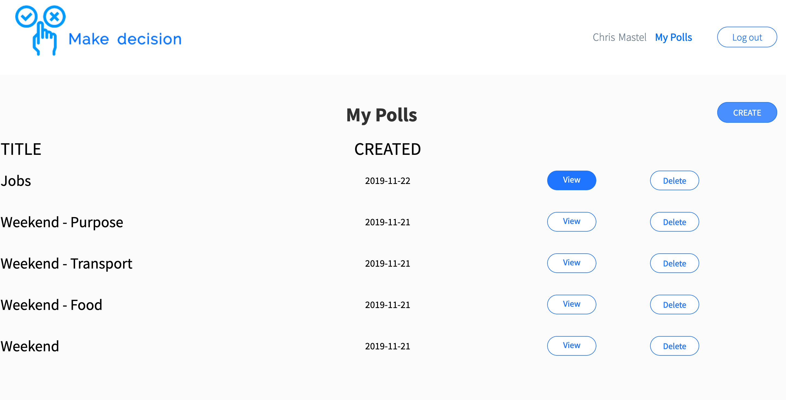
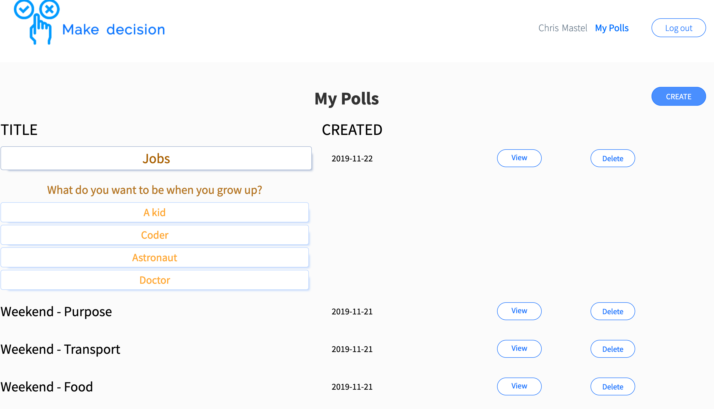
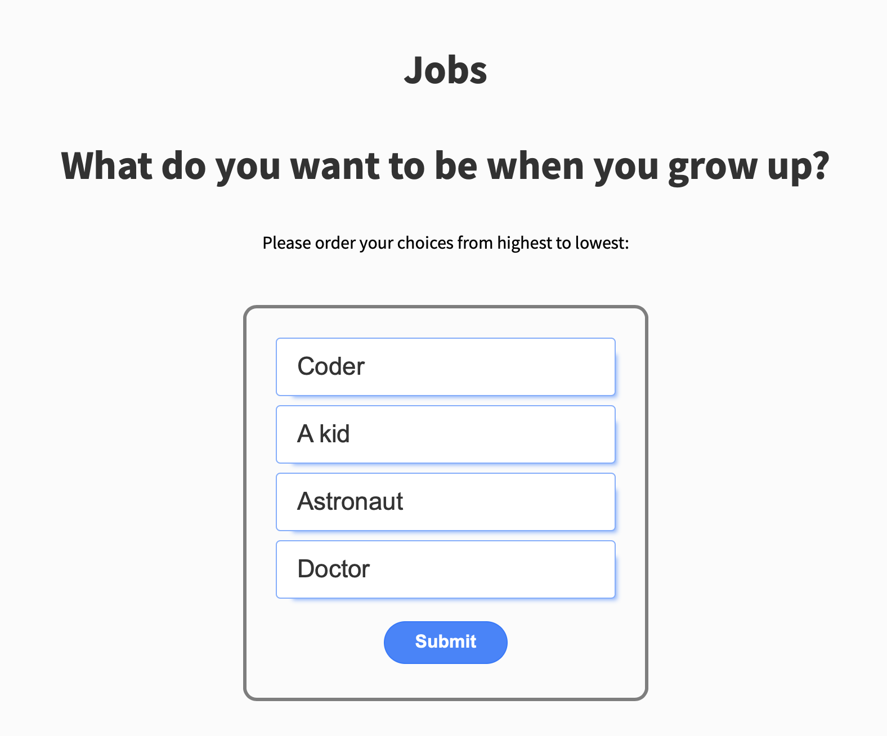
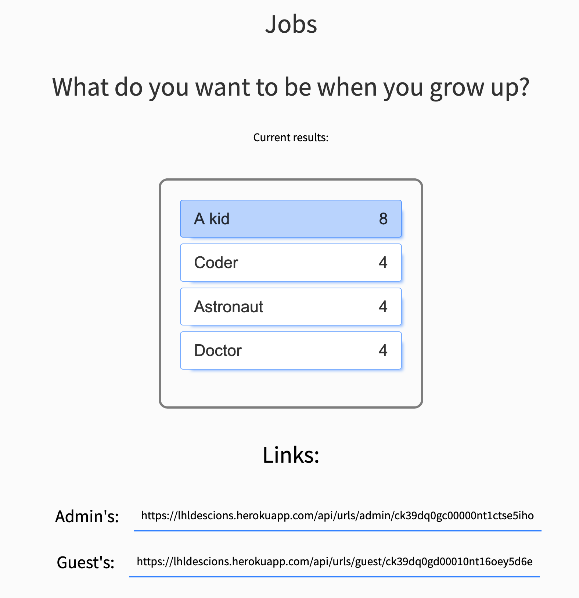

# Decision Maker Project

Decision Maker is a simple, mostly singe-page app that lets a group of friends make a decision.

By sending Polls are created by a poll administrator. Once created they receive two URL links; one to send to guests and the other for the adminstrator.

The guest url provides people the ability to drag and drop their preferences in order from highest to lowest, and then submit the results. 

THe adminstrator link allows the owner of the poll to see the current results, ranked according to a Bordo Score.

## Final Product

Primary My Polls page:

My Polls page expanded to show poll details:

Guest page to make choices on:

Admin page showing the results:

## Purpose

**_BEWARE:_ This project was published for learning purposes. It is _not_ intended for use in production-grade software.**

This project was created and published by me as part of my learnings at Lighthouse Labs. 

## Key Features

* Users can register and login to the app
* Once logged in, a user will see a list of their polls ordered with most recent on top
  * By clicking on the Poll Title, the associated Questions and Repsonses will slide down into view for easy reference
* Each poll consists of a Poll Title, Question, and space for four Responses
* Each Poll in the list has the ability to View the admin page for the poll, and to Delete the poll from the database
  * When a poll is deleted, all dependent table entries (i.e. questions, responses) are also deleted
* When viewing the My Polls page, the user has the ability to Create a new poll
* Once the details of the new poll are submitted, they are stored in the database and the user is presented with a summary page containing the Admin and Guest URL links
  * The user is also sent an email automatically when the poll is created, which also includes the Admin and Guest URL links
* The user can then copy the Guest URL link and send it to their guests by whatever means they desire (email, slack, IM, carrier pigeon, etc)
* Once the Guest opens the link, they have the ability to drag and drop the four options into their desired order or preference
  * Whenever a response is submitted, the Borda Score for the responses are tabulated and the values in the datebase are updated
  * An email is also automatically sent to the owner of thge poll showing that a new response has been received
* If the Guest tries to submit a response to a certain poll more than once, their response is not registered and they are presented with a warning message
* The owner of a poll can check their Admin URL link at anytime to see the current scores of each option, with the current high score highlighted

## Potential Future Additions

Over time, the following additinal features would improve the Make Decision app:
* Ability to add more than one question per poll (the database is already set up to accomodate this)
* The user should be able to set the number of responses per question dynamically
* Have links directly in the app so the owner of a poll can submit it to their social networks

## Getting Started

1. Fork this repository, then clone your fork of this repository.
2. Install dependencies using the `npm install` command.
3. Start the web server using the `npm run local` command. The app will be served at <http://localhost:8080/>.
4. Go to <http://localhost:8080/> in your browser.

## Dependencies

- Bcrypt
- BodyParser
- Chalk
- Cookie Session
- CUID
- Dependencies
- Dotenv
- ejs
- Express
- Express Sessions
- mailgun-js
- Morgan
- Node-Sass-Middleware
- PG
- PG native

